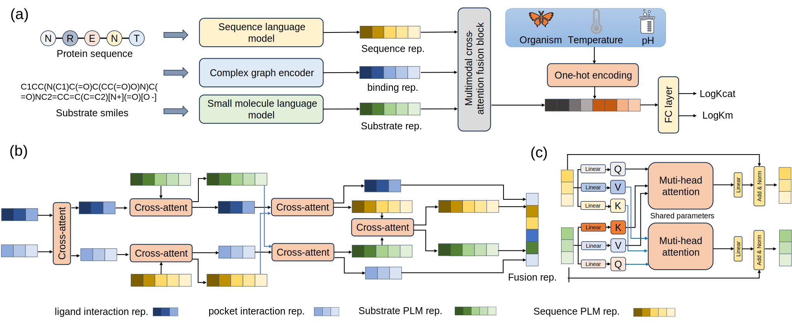

[](https://github.com/ld139/graphkcat)
[](https://doi.org/10.1101/2025.05.18.654694)


# Catalytic pocket-informed augmentation of enzyme kinetic parameters prediction via hierarchical graph learning
<div align=center>

</div> 


GraphKcat is a deep learning framework that integrates enzyme-substrate 3D binding conformations for precise kinetic parameter prediction

To run GraphKcat, clone this GitHub repository and install Python.

## Requirements

-  Operating System: Linux (Recommended)

## Install Dependencies
```
conda env create -f apodock.yaml
conda activate apodock

```

## Inference

A demo:

Use `.CSV` file for predicting:
```
python predict.py --csv_file test.csv --output_dir output
```
-----------------------------------------------------------------------------------------------------
Output example will in defalut dir `output/inference_results.csv`,  you can use `--output_dir` option to determine the output position.


-----------------------------------------------------------------------------------------------------

## Q&A
To be updated