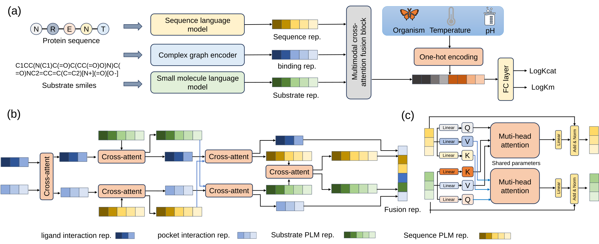

[](https://github.com/ld139/graphkcat)
[](https://doi.org/10.1101/2025.05.18.654694)

# GraphKcat: Catalytic Pocket-Augmented Learning for Enzyme Kinetic Parameter Prediction

<div align="center">

</div>

GraphKcat is a structure-aware deep learning framework for predicting enzyme kinetic parameters, including **kcat**, **Km**, and **kcat/Km**. The model integrates enzyme sequence representations, substrate representations, environmental variables, and catalytic pocket structural information derived from enzyme–substrate 3D complexes.

This repository provides the source code for model training, inference, dataset processing, and reproducibility of the experiments described in the manuscript.

---

## Overview

GraphKcat uses a multi-modal architecture that combines:

- enzyme sequence embeddings from pretrained protein language models;
- substrate molecular embeddings;
- catalytic pocket graphs extracted from enzyme–substrate complex structures;
- all-atom and coarse-grained graph representations;
- environmental variables, including organism source, pH, and temperature.

The framework can be used for:

1. training GraphKcat from processed datasets;
2. reproducing the reported benchmark experiments;
3. predicting kinetic parameters for new enzyme–substrate pairs.

---

## Repository Structure

```text
GraphKcat/
├── model_enz.py                      # GraphKcat model architecture
├── train.py                          # Training script
├── predict.py                        # Inference script
├── dataset_graphkcat_chai1.py         # Dataset and dataloader utilities
├── preprocessing_inference.py         # Preprocessing utilities for inference
├── config/
│   └── config_dict.py                 # Model and training configurations
├── sub_utils/
│   ├── all_organism_set.npy           # Organism vocabulary
│   └── temp_set.npy                   # Temperature encoding reference
├── checkpoint/
│   └── paper.pt                       # Pretrained checkpoint
├── example/
│   ├── test.csv                       # Example input file
│   └── structure_example/             # Example structure files
├── datasets/
│   ├── train_dataset.csv              # Training set
│   ├── valid_dataset.csv              # Validation set
│   └── test_dataset.csv               # Test set
├── apodock.yaml                       # Conda environment file
└── README.md
```

If large files such as processed datasets, embeddings, or checkpoints are not stored directly in GitHub because of file-size limitations, they can be downloaded from:

```text
Dataset and checkpoint download link: [Zenodo/Figshare/Google Drive link]
```

Please place the downloaded files under the corresponding folders shown above.

---

## Requirements

GraphKcat has been tested on Linux systems.

Recommended environment:

```text
Python >= 3.9
PyTorch >= 2.0
PyTorch Geometric
CUDA >= 11.7
RDKit
BioPython
ESM
Uni-Mol tools
```

A GPU is recommended for both embedding generation and model inference. CPU inference is possible but can be slow, especially when generating ESM-2 or Uni-Mol embeddings.

---

## Installation

Clone the repository:

```bash
git clone https://github.com/ld139/graphkcat.git
cd graphkcat
```

Create the conda environment:

```bash
conda env create -f apodock.yaml
conda activate apodock
```

Install additional dependencies if necessary:

```bash
pip install torch-scatter torch-geometric
pip install biopython rdkit-pypi pandas tqdm
```

The exact versions used in the manuscript are provided in `apodock.yaml`.

---

## Data Availability

The processed datasets used in the manuscript are provided in the `datasets/` folder or can be downloaded from:

```text
[Dataset download link]
```

The released data include:

```text
train_dataset.csv
valid_dataset.csv
test_dataset.csv
```

Each row contains an enzyme–substrate pair and the corresponding kinetic labels. The main fields include:

```text
id
Smiles
protein
ligand
complex
organism
pH
temperature
log_kcat
log_Km
log_kcat_Km
```

For inference, users should provide a CSV file with at least the following columns:

```text
id
Smiles
protein
ligand
organism
pH
temperature
```

Alternatively, if a precomputed enzyme–substrate complex is available, the CSV file may include:

```text
complex
```

where `complex` points to the enzyme–substrate complex structure file.

---

## Pretrained Checkpoint

The pretrained GraphKcat model used in the manuscript is provided at:

```text
checkpoint/paper.pt
```

If the checkpoint is not included in the GitHub repository because of file-size limitations, please download it from:

```text
[Checkpoint download link]
```

After downloading, place it under:

```text
checkpoint/paper.pt
```

---

## Training

To train GraphKcat from the processed training dataset, run:

```bash
python train.py \
    --train_csv datasets/train_dataset.csv \
    --valid_csv datasets/valid_dataset.csv \
    --output_dir output/train_graphkcat \
    --cfg TrainConfig_kcat_enz
```

The training script saves model checkpoints, training logs, and validation metrics to the specified output directory.

Example output structure:

```text
output/train_graphkcat/
├── checkpoints/
├── train_log.csv
└── valid_metrics.csv
```

To reproduce the main benchmark setting reported in the manuscript, please use the configuration:

```bash
--cfg TrainConfig_kcat_enz
```

The corresponding hyperparameters, including hidden dimension, number of graph layers, dropout rate, pooling strategy, and fully connected layers, are defined in:

```text
config/config_dict.py
```

---

## Inference

A minimal inference example is provided in:

```text
example/test.csv
```

Run:

```bash
python predict.py \
    --csv_file example/test.csv \
    --output_dir output/inference \
    --cpkt_path checkpoint/paper.pt \
    --cfg TrainConfig_kcat_enz \
    --batch_size 1
```

The prediction results will be saved to:

```text
output/inference/predictions_*.csv
```

The output file contains:

```text
id
pred_log_kcat_graphkcat
pred_log_km_graphkcat
pred_log_kcat_km_graphkcat
```

For large-scale inference, users may increase `--batch_size` depending on available GPU memory.

---

## Reproducibility

To improve reproducibility, this repository provides:

1. the full model architecture;
2. training and inference scripts;
3. processed dataset files or download links;
4. pretrained model checkpoint;
5. configuration files used in the manuscript;
6. example input files for testing the inference pipeline.

For deterministic training, users can set a random seed in the training script:

```bash
python train.py \
    --train_csv datasets/train_dataset.csv \
    --valid_csv datasets/valid_dataset.csv \
    --output_dir output/reproduce \
    --cfg TrainConfig_kcat_enz \
    --seed 42
```

Because some GPU operations in PyTorch and PyTorch Geometric may be nondeterministic, minor numerical differences may occur across hardware and CUDA versions. However, the overall predictive performance should remain consistent with the reported results when using the provided datasets, checkpoint, and configuration.

---

## Expected Runtime and Memory Usage

The runtime depends on the number of enzyme–substrate pairs, protein sequence length, and pocket size.

Recommended inference setting:

```bash
--batch_size 1
```

For GPUs with larger memory, `--batch_size 2`, `4`, or `8` may be used.

Embedding generation with ESM-2 and Uni-Mol can be computationally expensive. For large datasets, we recommend precomputing and saving embeddings before running GraphKcat inference.

---

## Example

Input CSV example:

```csv
id,Smiles,protein,ligand,organism,pH,temperature
example_001,CCO,example/structure_example/example_001_protein.pdb,example/structure_example/example_001_ligand.sdf,Escherichia coli,7.0,298.15
```

Run inference:

```bash
python predict.py --csv_file example/test.csv --output_dir output/inference
```

Expected output:

```csv
id,pred_log_kcat_graphkcat,pred_log_km_graphkcat,pred_log_kcat_km_graphkcat
example_001,1.23,-0.45,1.68
```

The numerical values above are only illustrative.

---

## Troubleshooting

### 1. Out-of-memory error during inference

Reduce batch size:

```bash
--batch_size 1
```

If attention maps are not needed, make sure the inference script does not return attention tensors.

### 2. Missing structure files

Please ensure that the paths in the input CSV point to existing protein, ligand, or complex structure files.

### 3. Missing checkpoint

Download the pretrained checkpoint and place it under:

```text
checkpoint/paper.pt
```

### 4. Slow preprocessing

ESM-2 and Uni-Mol embedding generation can be slow. We recommend generating embeddings once and reusing the saved `.pt` files for subsequent inference.

---

## Citation

If you use GraphKcat in your research, please cite:

```text
[Full citation after publication]
```

Preprint:

```text
GraphKcat: Catalytic pocket-informed augmentation of enzyme kinetic parameters prediction via hierarchical graph learning.
bioRxiv 2025.05.18.654694.
https://doi.org/10.1101/2025.05.18.654694
```

---

## License

This project is released under the MIT License.